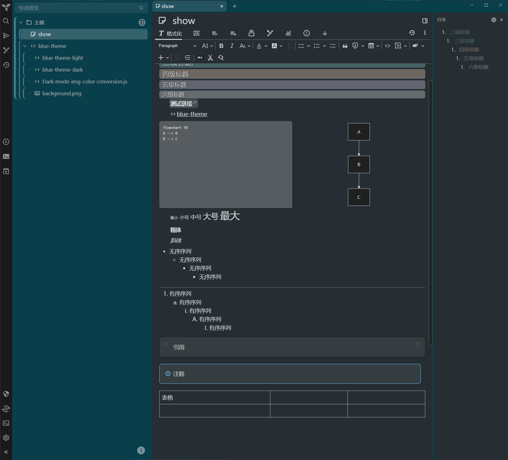

**Both updates and fixes come from the [Blue-theme](https://github.com/SiriusXT/trilium-theme-blue), this is just a temporary update and some minor adjustments**

**更新和修复均来自 [Blue-theme](https://github.com/SiriusXT/trilium-theme-blue)，这里是临时更新和一些微调**

# [Blue-theme](https://github.com/SiriusXT/trilium-theme-blue)

Version:0.10 For trilium-NEXT:>=0.92.4 Dark-mode-img-color-conversion.js version:0.10

版本：0.10 适用于 trilium-NEXT：>=0.92.4 暗黑模式图片颜色转换.js 版本：0.10

## Updated 

### fix | 修复

1. [外部链接和内部链接均会出现奇怪的空格](https://github.com/SiriusXT/trilium-theme-blue/issues/19)
2. [美人鱼图中出现奇怪的空格](https://github.com/SiriusXT/trilium-theme-blue/issues/20)
3. [提升笔记后，目录树格式出错](https://github.com/SiriusXT/trilium-theme-blue/issues/18)

这里只是套用了原作者的临时修复方案，没什么实质性贡献

### 微调

1. 调亮暗色模式的背景颜色，使文字不这么刺眼
2. 更改左侧目录树和顶部的背景颜色，更蓝
3. 暗色模式中添加少量中文注释，方便修改

